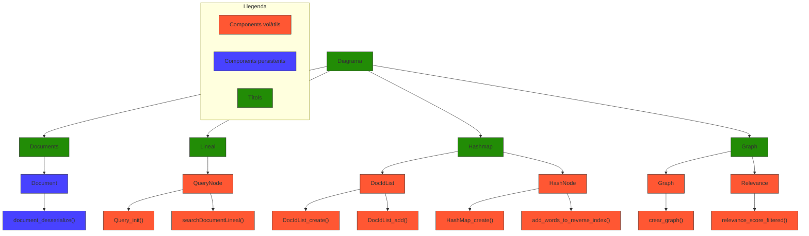

# Report grup 202

---

## Esquema funcional del codi

---

## Complexitat temporal de les operacions principals del sistema de cerca

| Descripció                                        | Big-O     | Justificació                         |
| ------------------------------------------------- | --------- | ------------------------------------ |
| Anàlisi Document i convertir-lo a estructura      | O(N+L)    | Depèn del nombre de paraules del document (N) i del seu nombre d'enllaços (L)                |
| Anàlisi consulta i convertir-la a estructura      | O(K)      | Depèn del nombre de paraules (K) de la consulta                   |
| Recompte de veïns dins del graf                   | O(V+E)    | Depèn de tots els vèrtexs (V) del graf, que representen els documents, i de totes les arestes (E), que representen els links             |
| Recompte veïns d’un document                      | O(D)      | Depèn del nombre d'enllaços/grau (D) que tingui aquell document              |
| Cerca documents per paraula                       | O(1)      | El Hashmap ens permet tenir una complexitat de O(1)                        |
| Documents que coincideixin amb totes les paraules | O(K*M)    | Depèn del nombre de paraules (K) de la consulta i de la llista més gran (M) entre els documents que contenen aquestes paraules|
| Ordenar per rellevància                           | O(N^2) | Ordenació mitjançant BubbleSort     |

---

## 1. Temps de cerca amb i sense índex invers

**Comentari:**  
La corba sense índex invers creix gairebé linealment a mesura que augmenta el nombre de documents, fet que evidencia que cada cerca recorre tots els elements. En canvi, l’ús de l’índex invers redueix dràsticament el temps a un creixement logarítmic, mostrant una millora substancial en escalabilitat.

---

## 2. Temps d’inicialització per a diferents valors de caselles del hashmap

**Comentari:**  
A mesura que s’incrementa el nombre de caselles del hashmap, el temps d’inicialització augmenta de manera directament proporcional, ja que cal reservar i configurar més cel·les en memòria. Això indica que escollir un nombre massa alt de caselles pot disparar el cost inicial sense necessitat real, per la qual cosa convé equilibrar-ho segons la mida esperada del conjunt de dades.

---

## 3. Temps de cerca per a diferents valors de caselles del hashmap

**Comentari:**  
Amb un major nombre de caselles, el temps de cerca decreix ràpidament fins a estabilitzar-se, ja que la probabilitat de col·lisions disminueix i cada accés és més directe. Tanmateix, passat un cert punt, afegir més caselles genera poc guany en velocitat, així que hi ha un punt òptim on el cost de memòria i el rendiment de cerca s’equilibren.

---

## Millora de l’índex invers amb tries per optimitzar cerca i memòria

Una possible millora de l’índex invers per augmentar la velocitat de cerca i inicialització és utilitzar tries (arbres de prefixos) en lloc de hashmaps. Aquesta estructura emmagatzema les paraules compartint els prefixos, fet que pot reduir l’ús de memòria en casos on hi ha moltes paraules similars, tot i que en casos amb paraules molt diferents podria augmentar-lo. La complexitat temporal de cerca és O(L), sent L la longitud de la paraula, i la d'inicialització O(N * L), on N és el nombre de paraules. Tot i que la inicialització pot trigar una mica més, la cerca pot ser significativament més ràpida, especialment quan es treballa amb consultes de prefixos. Aquesta millora pot fer que el sistema sigui més eficient a llarg termini si les cerques són freqüents.