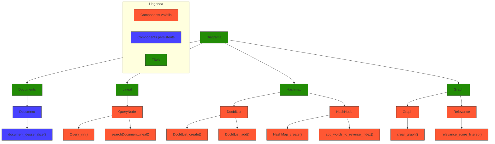

# Report Grup 48

---

## Esquema funcional del codi

**Quina és l'estructura del diagrama?**  
L'estructura que hem decidit implementar ha estat separar el diagrama per les 4 coses que considerem més importants del nostre codi, les quals són els documents, la cerca lineal, el Hashmap i el Graf. Un cop amb això, hem afegit la principal o principals estructures d'aquesta part i després les principals funcions d'aquestes parts respectives també.

---

## Complexitat temporal de les operacions principals del sistema de cerca

| Descripció                                        | Big-O     | Justificació                         |
| ------------------------------------------------- | --------- | ------------------------------------ |
| Anàlisi Document i convertir-lo a estructura      | O(N+L)    | Depèn del nombre de paraules del document (N) i del seu nombre d'enllaços (L)                |
| Anàlisi consulta i convertir-la a estructura      | O(K)      | Depèn del nombre de paraules (K) de la consulta                   |
| Recompte de veïns dins del graf                   | O(V+E)    | Depèn de tots els vèrtexs (V) del graf, que representen els documents, i de totes les arestes (E), que representen els links             |
| Recompte veïns d’un document                      | O(D)      | Depèn del nombre d'enllaços/grau (D) que tingui aquell document              |
| Cerca documents per paraula                       | O(1)      | El Hashmap ens permet tenir una complexitat de O(1)                        |
| Documents que coincideixin amb totes les paraules | O(K*M)    | Depèn del nombre de paraules (K) de la consulta i de la llista més gran (M) entre els documents que contenen aquestes paraules|
| Ordenar per rellevància                           | O(N^2) | Ordenació mitjançant BubbleSort     |

---

## 1. Temps de cerca amb i sense índex invers

**Comentari:**  
Podem observar com amb la cerca sense índex invers augmenta gairebé de forma lineal amb el temps, fet que provoca que a major nombre de documents, trigui major temps. En canvi, podem observar com l’ús de cerca amb índex invers permet una cerca logarítmica (log(n)), però que podem observar que com amb més documents, el temps de cerca cada vegada es torna més constant.

---

## 2. Temps d’inicialització per a diferents valors de caselles del hashmap

**Comentari:**  
Podem observar com a mesura que augmenta el nombre de caselles del Hashmap, el temps d’inicialització creix proporcionalment a ell, ja que cal reservar memòria. Tot i aquest entrebanc inicial, a llarg termini acaba sent molt més eficient durant les cerques posteriors (es pot observar a la següent figura).

---

## 3. Temps de cerca per a diferents valors de caselles del hashmap

**Comentari:**  
Podem observar com a mesura que augmenta el nombre de caselles del hashmap, el temps de cerca decreix exponencialment. Tot i així, a efectes pràctics, la complexitat es manté constant O(1), el que passa és que, en la nostra gràfica, "el temps està en mil·lèsimes de segon i no en segons" (tot i que estigui en segons), cosa que pot donar una aparença de disminució exponencial, tot i que en realitat el temps de cerca es manté pràcticament constant.

---

## Millora de l’índex invers amb tries per optimitzar cerca i memòria

Per millorar la velocitat d’inicialització, el que podríem implementar és la serialització i deserialització de l’índex invers. Això, consisteix a guardar tota la informació de l’índex (paraules i documents associats) en un fitxer un cop creat, per tal que en futures execucions es pugui carregar aquest fitxer directament, evitant haver de processar tots els documents des de zero i accelerant significativament la inicialització.  
Sí que seria necessari l’ús d’una mica de memòria addicional, ja que l’índex s'emmagatzemaria igual, però necessitaria emmagatzemar-se en un fitxer per reutilitzar-lo.  
La complexitat es reduiria, ja que de tenir-ne una de O(D * P), on D és el nombre de documents i P el nombre de paraules processades, tindríem O(S), on S seria la mida del fitxer.  
Per tant, trigaria menys temps a executar-se, ja que no tornaria a processar tota la informació i el que faria seria llegir l’índex preparat.

Per millorar la velocitat de cerca el que podríem implementar és una funció que ordenés les llistes de documents per la freqüència de les paraules en ordre creixent abans de fer la intersecció, ja que així estem limitant el nombre d’elements a comparar, cosa que provocarà que la intersecció sigui més ràpida. (Exemple→ Si estem buscant 'the cat', començarem buscant 'cat', ja que apareix a menys documents i, per tant, si no està 'cat', ja no caldrà buscar 'the', que segurament estava als 5400 documents).  
El fet d’ordenar les llistes per freqüència ocuparia lleugerament una mica més memòria addicional.  
Aquest canvi fa que la complexitat passi de O(K * M), on K és el nombre de paraules i M la mida màxima de les llistes, a O(K * M log(M)) a causa del procés d’ordenació. Tot i això, la intersecció següent serà molt més eficient, ja que es compararan menys elements, la qual cosa reduirà el temps total de cerca.  
Resumint, encara que l’ordenació afegeixi un cost inicial, el temps global serà menor pel fet que la cerca serà més ràpida i optimitzada.

Una altra millora que podríem implementar seria utilitzar MergeSort en comptes de BubbleSort a l’hora d’ordenar les rellevàncies, ja que la seva complexitat es reduiria de O(n^2) a O(n log(n)).
