# Report grup 202

```mermaid
flowchart TD

    %% Nodo raíz
    DIAG["Diagrama"] 

    %% Rama Documents
    DIAG --> DOCUMENTS["Documents"]
    DOCUMENTS --> DOCUMENT["Document"]
    DOCUMENT --> FUNC_DESERIALIZE["document.deserialize()"]

    %% Rama Lineal
    DIAG --> LINEAL["Lineal"]
    LINEAL --> QNODE["QueryNode"]
    QNODE --> FUNC_Q_INIT["query.init()"]
    QNODE --> FUNC_SEARCH_DOC_LINEAL["search.document.lineal()"]

    %% Rama Hashmap
    DIAG --> HASHMAP["Hashmap"]
    HASHMAP --> DOCLIST["DocIdList"]
    DOCLIST --> FUNC_DOCLIST_CREATE["DocIdList.create()"]
    DOCLIST --> FUNC_DOCLIST_ADD["DocIdList.add()"]
    HASHMAP --> HASHNODE["HashNode"]
    HASHNODE --> FUNC_HASHMAP_INIT["HashMap.init()"]
    HASHNODE --> FUNC_ADD_WORD["add-word-to-reverse-index()"]

    %% Rama Graph
    DIAG --> GRAPH["Graph"]
    GRAPH --> GRAPH_NODE["Graph"]
    GRAPH_NODE --> FUNC_WAR_GRAPH["war-graph()"]
    GRAPH --> RELEVANCE["Relevance"]
    RELEVANCE --> FUNC_REL_SCAN["relevance-scan()"]
    RELEVANCE --> FUNC_FILTERED["filtered()"]

    %% Estilos de colores
    style DIAG fill:#228c06,stroke:#333,stroke-width:1px

    style DOCUMENTS fill:#ff5733,stroke:#333,stroke-width:1px
    style DOCUMENT fill:#ff5733,stroke:#333,stroke-width:1px
    style FUNC_DESERIALIZE fill:#4842ff,stroke:#333,stroke-width:1px

    style LINEAL fill:#ff5733,stroke:#333,stroke-width:1px
    style QNODE fill:#ff5733,stroke:#333,stroke-width:1px
    style FUNC_Q_INIT fill:#4842ff,stroke:#333,stroke-width:1px
    style FUNC_SEARCH_DOC_LINEAL fill:#4842ff,stroke:#333,stroke-width:1px

    style HASHMAP fill:#ff5733,stroke:#333,stroke-width:1px
    style DOCLIST fill:#ff5733,stroke:#333,stroke-width:1px
    style FUNC_DOCLIST_CREATE fill:#4842ff,stroke:#333,stroke-width:1px
    style FUNC_DOCLIST_ADD fill:#4842ff,stroke:#333,stroke-width:1px
    style HASHNODE fill:#ff5733,stroke:#333,stroke-width:1px
    style FUNC_HASHMAP_INIT fill:#4842ff,stroke:#333,stroke-width:1px
    style FUNC_ADD_WORD fill:#4842ff,stroke:#333,stroke-width:1px

    style GRAPH fill:#ff5733,stroke:#333,stroke-width:1px
    style GRAPH_NODE fill:#ff5733,stroke:#333,stroke-width:1px
    style FUNC_WAR_GRAPH fill:#4842ff,stroke:#333,stroke-width:1px
    style RELEVANCE fill:#ff5733,stroke:#333,stroke-width:1px
    style FUNC_REL_SCAN fill:#4842ff,stroke:#333,stroke-width:1px
    style FUNC_FILTERED fill:#4842ff,stroke:#333,stroke-width:1px

    %% Leyenda (opcional)
    subgraph Leyenda["Llegenda"]
        green["Component/ms en memòria"] 
        purple["Funcions/operacions"]
    end

    style green fill:#ff5733,stroke:#333,stroke-width:1px
    style purple fill:#4842ff,stroke:#333,stroke-width:1px
```

| Descripció                                         | Big-O    | Justificació                   |
|----------------------------------------------------|----------|--------------------------------|
| Anàlisi Document i convertir-lo a estructura       | O(N+L)   | N paraules, L enllaços         |
| Anàlisi consulta i convertir-la a estructura       | O(K)     | K paraules (query)             |
| Recompte de veïns dins del graf                     | O(V+E)   | V documents, E enllaços        |
| Recompte veïns d’un document                       | O(D)     | D enllaços del document        |
| Cerca documents per paraula                         | O(1)     | Accés hashmap                  |
| Documents que coincideixin amb totes les paraules   | O(K*M)   | K paraules, M docs màxim per paraules |
| Ordenar per rellevància                             | O(M log M) |                                |

| Descripció                                        | Big-O     | Justificació                         |
| ------------------------------------------------- | --------- | ------------------------------------ |
| Anàlisi Document i convertir-lo a estructura      | O(N+L)    | N paraules, L enllaços               |
| Anàlisi consulta i convertir-la a estructura      | O(K)      | K paraules (query)                   |
| Recompte de veïns dins del graf                   | O(V+E)    | V documents, E enllaços              |
| Recompte veïns d’un document                      | O(D)      | D enllaços del document              |
| Cerca documents per paraula                       | O(1)      | Accés hashmap                        |
| Documents que coincideixin amb totes les paraules | O(K·M)    | K paraules, M docs màxim per paraula |
| Ordenar per rellevància                           | O(M·logM) | Ordenació clàssica de M elements     |
